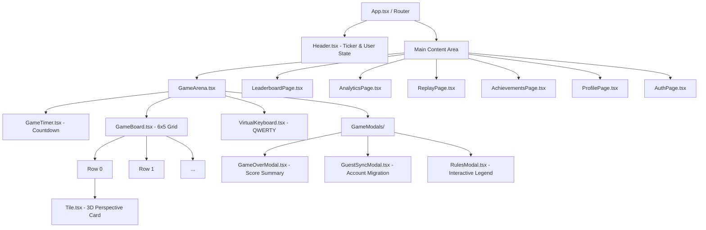
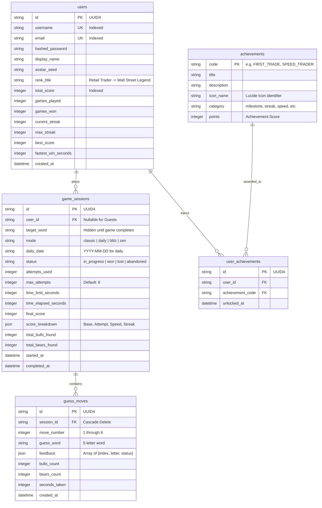

# Bulls & Bears Word Puzzle Platform — System & UI/UX Design

<div align="center">
  
  
  
</div>

---

## 1. Design Philosophy & Aesthetic Identity

**Bulls & Bears** melds the rigorous, high-information density of a **Bloomberg Financial Terminal** with the tactile delight and sleek neon gradients of **Modern Cyberpunk Minimalism**. 

Traditional word games often feel static or passive; Bulls & Bears transforms deductive reasoning into a high-stakes trading floor environment. Every keystroke feels like an order entry; every evaluation feels like market settlement.

### Key Visual & Interactive Tenets:
1. **Dark Void Canvas (`#070a11`)**: Minimizes eye strain during rapid play, maximizing contrast for game state feedback.
2. **Tactile Haptic & Audio Feedback**: Custom Web Audio API waveforms emulate keyboard switches, ticker bells, and execution chimes.
3. **3D Perspective Physicality**: Letter tiles rotate along the X-axis in physical 3D space (`rotateX`) to reveal market status.
4. **Information Density with Zero Clutter**: Clean monospace typography for financial figures, paired with crisp sans-serif headings.

---

## 2. Color System & Design Tokens

```
┌────────────────────────────────────────────────────────────────────────┐
│                          COLOR TOKEN SYSTEM                            │
├─────────────────────┬───────────────────┬──────────────────────────────┤
│ Token Name          │ Hex Value         │ Role / Meaning               │
├─────────────────────┼───────────────────┼──────────────────────────────┤
│ --color-bull        │ #10b981 (Emerald) │ Bull (Exact Match & Position)│
│ --color-bull-glow   │ #059669           │ Neon Ambient Box Shadow      │
│ --color-bear        │ #f59e0b (Amber)   │ Bear (Letter Exists, Wrong)  │
│ --color-bear-glow   │ #d97706           │ Ambient Volatility Glow      │
│ --color-miss        │ #334155 (Slate)   │ Miss (Liquidity Void)        │
│ --color-bg          │ #070a11 (Deep)    │ Terminal Canvas              │
│ --color-surface     │ #111827 (Dark)    │ Cards, Panels, Modals        │
│ --color-border      │ #1e293b (Subtle)  │ Grid Borders & Dividers      │
│ --color-accent      │ #38bdf8 (Cyan)    │ Interactive Links & Focus    │
│ --color-gold        │ #fbbf24 (Gold)    │ Rank Titles, Crowns, Streaks │
└─────────────────────┴───────────────────┴──────────────────────────────┘
```

### CSS Variables Implementation (`index.css`):
```css
:root {
  --color-bull: #10b981;
  --color-bull-glow: rgba(16, 185, 129, 0.4);
  --color-bear: #f59e0b;
  --color-bear-glow: rgba(245, 158, 11, 0.4);
  --color-miss: #334155;
  --color-bg: #070a11;
  --color-surface: #111827;
  --color-border: #1e293b;
}
```

---

## 3. 3D Keyframe Animations & Micro-Interactions

### 3.1 3D Flip Reveal (`rotateX`)
When a guess is committed, tiles flip chronologically with an index-staggered delay ($j \times 250\text{ms}$). At the 50% midpoint ($90^\circ$), the background switches from slate border to its Bull/Bear/Miss status with an active glow:

```css
@keyframes flipRevealBull {
  0% { transform: rotateX(0deg); background-color: transparent; }
  49% { transform: rotateX(90deg); background-color: transparent; }
  50% { transform: rotateX(90deg); background-color: #059669; border-color: #10b981; }
  100% {
    transform: rotateX(0deg);
    background-color: #059669;
    border-color: #10b981;
    box-shadow: 0 0 15px rgba(16, 185, 129, 0.4);
  }
}

@keyframes flipRevealBear {
  0% { transform: rotateX(0deg); background-color: transparent; }
  49% { transform: rotateX(90deg); background-color: transparent; }
  50% { transform: rotateX(90deg); background-color: #d97706; border-color: #f59e0b; }
  100% {
    transform: rotateX(0deg);
    background-color: #d97706;
    border-color: #f59e0b;
    box-shadow: 0 0 15px rgba(245, 158, 11, 0.4);
  }
}
```

### 3.2 Shake on Invalid Guess
If the submitted word is not in the 14,800+ valid dictionary, the active row triggers a high-frequency horizontal jitter:
```css
@keyframes shakeRow {
  0%, 100% { transform: translateX(0); }
  20%, 60% { transform: translateX(-6px); }
  40%, 80% { transform: translateX(6px); }
}
```

### 3.3 Pop on Keystroke
Typing a letter applies a gentle scale pop ($1.0 \to 1.15 \to 1.0$) confirming immediate receipt without audio latency.

---

## 4. Frontend Component Hierarchy



---

## 5. Global State Architecture (Zustand)

Rather than heavy Redux boilerplate, the client employs specialized lightweight **Zustand** stores with localStorage persistence:

```
┌─────────────────────────────────────────────────────────────┐
│                       ZUSTAND STORES                        │
├─────────────────────┬───────────────────────────────────────┤
│ Store Name          │ Responsibility                        │
├─────────────────────┼───────────────────────────────────────┤
│ useGameStore        │ Active session, current guess buffer, │
│                     │ 6-row history, tile feedback, timer,  │
│                     │ keyboard letter statuses, modal state │
├─────────────────────┼───────────────────────────────────────┤
│ useAuthStore        │ JWT access token, player user profile,│
│                     │ guest stats cache, login/logout logic │
├─────────────────────┼───────────────────────────────────────┤
│ useSoundStore       │ Audio enabled/disabled toggle, volume │
│                     │ control, sound preset configurations  │
├─────────────────────┼───────────────────────────────────────┤
│ useThemeStore       │ Color-blind high-contrast toggle,     │
│                     │ terminal effects toggle               │
└─────────────────────┴───────────────────────────────────────┘
```

### 5.1 Web Audio API Synthesizer (`services/audio.ts`)
Instead of shipping bulky `.mp3` or `.wav` asset files, all audio is generated algorithmically on-the-fly using the browser's native `AudioContext`:
* **Keystroke Click**: 800 Hz sine wave burst (15ms).
* **Tile Flip Reveal**: Ascending frequency sweep (300 Hz $\to$ 600 Hz).
* **Bull Sound**: Harmonious major third chord (523.25 Hz C5 + 659.25 Hz E5).
* **Bear Sound**: Neutral suspended fourth chime (440 Hz A4 + 587.33 Hz D5).
* **Win Celebration**: Wall Street opening bell fanfare triad.
* **Loss / Market Crash**: Descending frequency sawtooth glide with low-pass resonance.

---

## 6. Database Entity-Relationship (ER) Model



---

## 7. Security & Anti-Cheat Specifications

1. **Server-Side Word Masking**: The client **never** receives the secret target word until the session reaches terminal status (`won`, `lost`, or `abandoned`). Inspecting network traffic or local state cannot reveal the solution.
2. **Server-Side Validation**: Every guess is strictly verified against the server-side dictionary (`WordDictionary.is_valid_guess`) and evaluated by the backend solver.
3. **Stat Manipulation Defense**: All scores, time deductions, and streak increments are computed strictly within `GameService` and `ScoringEngine` on the server.
4. **Password Hashing**: Uses modern Passlib with Bcrypt cryptographic salt rounds.
5. **JWT Tampering Protection**: Tokens are signed using `HS256` with strict expiration checks.

---

## 8. Accessibility & Responsiveness

* **Responsive Breakpoints**: Seamless scaling across mobile screens ($320\text{px}$ to $480\text{px}$), tablets ($768\text{px}$), and wide desktop monitors ($1200\text{px}+$).
* **Touch-Optimized Virtual Keyboard**: Minimum 48px touch hit-targets conforming to WCAG 2.1 touch guidelines.
* **Physical Keyboard Integration**: Native listener hooks (`window.addEventListener('keydown')`) supporting instant typing, Backspace, and Enter keys.
* **Color Blind Mode Consideration**: Bulls and Bears are differentiated by color, icon, and position labels.
