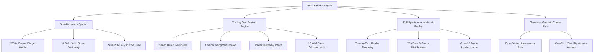

# Bulls & Bears Word Puzzle Platform — Project Specification

<div align="center">
  
  
  
</div>

---

## 1. Executive Summary

**Bulls & Bears** is an adrenaline-fueled, Wall Street trading-themed deductive word puzzle platform. Inspired by the classic code-breaking game *Bulls & Cows* and popularized by modern word games like *Wordle*, Bulls & Bears reimagines word puzzles through the lens of a high-frequency financial trading room.

Players step onto the trading floor as speculative analysts, attempting to decipher secret 5-letter target words under market volatility, strict time limits, and compounding score multipliers. Every guess is an executed trade:
* **Bull ($\mathcal{B}$)**: Correct letter in the exact correct position (Green / Long Position).
* **Bear ($\mathcal{R}$)**: Correct letter, but positioned incorrectly (Amber / Short Hedge).
* **Miss ($\mathcal{M}$)**: Letter not found in the target word (Liquidity Void).

The platform combines a blazing-fast **FastAPI** asynchronous backend, a **React 19 + TypeScript + Vite** frontend, synthesized **Web Audio API** sound effects, interactive **3D perspective tile animations**, and a **Wall Street Trader Rank** competitive system.

---

## 2. Core Pillars & Value Propositions



### 2.1 Wall Street Trading Floor Atmosphere
* Dark Bloomberg-terminal-inspired palette with vibrant emerald (`#10b981`) and amber (`#f59e0b`) accents.
* Synthesized audio feedback reproducing floor bells, trade executions, tick counters, and market bell victories.
* Financial market terminology woven seamlessly throughout: trades, tickers, streaks, liquidity, and portfolio yields.

### 2.2 Dual-Dictionary Engine
The game maintains an isolated two-tier dictionary for fairness and depth:
1. **Target Words (`words_target.txt`)**: 2,500+ curated, recognizable English 5-letter words preventing obscure or archaic solution traps.
2. **Valid Guess Dictionary (`words_valid.txt`)**: 14,800+ comprehensive English 5-letter words allowing flexible, creative tactical guessing.
3. **Deterministic Daily Engine**: Computes a SHA-256 date hash (`YYYY-MM-DD`) mapped into the target word bank, ensuring every player worldwide plays the identical daily market challenge.

### 2.3 Dynamic Scoring Algorithm
The platform rewards speed, precision, and consistency:
$$\text{Total Score} = \text{Base Points} + \text{Attempt Bonus} + \text{Speed Multiplier} + \text{Streak Bonus}$$

* **Base Win Points**: $+1,000\text{ pts}$
* **Attempt Premium**: $+250\text{ pts}$ per unused attempt remaining
* **Speed Dividend**: Up to $+500\text{ pts}$ based on remaining seconds on the timer
* **Streak Multiplier**: $+10\%$ compounding bonus per consecutive win (capped at $+100\%$)
* **Golden Bull Bonus**: $+2,500\text{ pts}$ instantaneous execution for solving on Turn 1

---

## 3. Game Modes

| Mode | Time Limit | Attempts | Daily Cap | Target Selection | Leaderboard Impact |
| :--- | :---: | :---: | :---: | :--- | :--- |
| **Classic Trading** | 120 sec | 6 | Unlimited | Random curated selection | Standard ELO & Score |
| **Daily Market Puzzle** | 120 sec | 6 | 1 per UTC Day | Deterministic SHA-256 hash | Global Daily Standings |
| **Blitz Mode** | 60 sec | 6 | Unlimited | High-frequency random word | $1.5\times$ Speed Multipliers |
| **Zen Mode** | $\infty$ | 6 | Unlimited | Practice word pool | Non-ranked / Practice |

---

## 4. Trader Progression & Hierarchy

Players advance through Wall Street titles based on accumulated career trading scores:

```
[Retail Trader] ─────────► [Junior Analyst] ─────────► [Prop Trader]
 (0 - 499 pts)              (500 - 1,499 pts)          (1,500 - 4,999 pts)
                                                              │
                                                              ▼
[Wall Street Legend] ◄──── [Market Maker] ◄──── [Quantitative Strategist]
 (50,000+ pts)              (25,000 - 49,999)    (5,000 - 9,999 pts)
```

| Rank Title | Score Threshold | Tier Perks |
| :--- | :--- | :--- |
| **Retail Trader** | 0 – 499 pts | Base terminal access, local game saves |
| **Junior Analyst** | 500 – 1,499 pts | Unlocks weekly leaderboard ranking |
| **Prop Trader** | 1,500 – 4,999 pts | Dynamic win streak badges |
| **Quant Strategist**| 5,000 – 9,999 pts | Access to deep analytics telemetry |
| **Fund Manager** | 10,000 – 24,999 pts | Custom avatar badge glow |
| **Market Maker** | 25,000 – 49,999 pts | Highlighted global leaderboard listing |
| **Wall Street Legend**| 50,000+ pts | Golden crown icon and permanent hall of fame |

---

## 5. System Architecture

```
┌─────────────────────────────────────────────────────────────────┐
│                       Frontend (Client)                         │
│  React 19 + TypeScript + Vite + Tailwind CSS v4 + Zustand       │
│                                                                 │
│  ┌───────────────┐ ┌───────────────┐ ┌───────────────────────┐  │
│  │   GameArena   │ │  Leaderboard  │ │   Replay & Analytics  │  │
│  └───────┬───────┘ └───────┬───────┘ └───────────┬───────────┘  │
│          └─────────────────┼─────────────────────┘              │
│                            ▼                                    │
│                 Axios API Client + JWT                          │
└────────────────────────────┬────────────────────────────────────┘
                             │ HTTPS / REST JSON
┌────────────────────────────▼────────────────────────────────────┐
│                    FastAPI Backend (Server)                     │
│  Python 3.12+ • Uvicorn • SQLAlchemy 2.0 Async • Pydantic v2   │
│                                                                 │
│  ┌───────────────────────┐    ┌──────────────────────────────┐  │
│  │   Auth / JWT Router   │    │      Gameplay Router         │  │
│  │  /api/auth/*          │    │      /api/games/*            │  │
│  └───────────────────────┘    └──────────────────────────────┘  │
│  ┌───────────────────────┐    ┌──────────────────────────────┐  │
│  │  Leaderboard Router   │    │     Analytics & Replay       │  │
│  │  /api/leaderboard     │    │     /api/analytics/*         │  │
│  └───────────────────────┘    └──────────────────────────────┘  │
│                            │                                    │
│  ┌─────────────────────────┴─────────────────────────────────┐  │
│  │                 Core Logic & Game Services                │  │
│  │   • WordDictionary Engine      • Scoring Engine           │  │
│  │   • Solver & Telemetry         • Achievement Evaluator    │  │
│  └─────────────────────────┬─────────────────────────────────┘  │
└────────────────────────────┼────────────────────────────────────┘
                             │ Async SQLAlchemy 2.0
┌────────────────────────────▼────────────────────────────────────┐
│                      Database Storage                           │
│  SQLite (Local Dev) / PostgreSQL (Production Compatible)        │
│  Tables: users, game_sessions, guess_moves, achievements, ...   │
└─────────────────────────────────────────────────────────────────┘
```

---

## 6. Directory Structure

```text
bulls&bears/
├── README.md                      # Primary project overview with rich CSS UI
├── docs/                          # Detailed architecture documentation
│   ├── Project.md                 # Project architecture & gameplay spec
│   ├── API.md                     # Complete REST API reference
│   └── Design.md                  # UI/UX, tokens, state & database design
├── backend/                       # FastAPI async backend
│   ├── app/
│   │   ├── api/                   # API route handlers
│   │   │   ├── auth.py            # Registration, login, profile, guest sync
│   │   │   ├── games.py           # Game lifecycle, move submission, abandon
│   │   │   ├── leaderboard.py     # Ranked standings & filters
│   │   │   ├── achievements.py    # Achievement unlocks & badges
│   │   │   └── analytics.py       # Performance charts & replay telemetry
│   │   ├── core/                  # Core configurations
│   │   │   ├── config.py          # Pydantic environment settings
│   │   │   ├── database.py        # SQLAlchemy 2.0 async engine & sessions
│   │   │   └── security.py        # Passlib bcrypt & JWT token handling
│   │   ├── data/                  # Word banks & dictionaries
│   │   │   ├── words_target.txt   # 2,500+ curated target words
│   │   │   └── words_valid.txt    # 14,800+ valid guess dictionary
│   │   ├── engine/                # Puzzle evaluation engines
│   │   │   ├── dictionary.py      # WordDictionary singleton & daily hash
│   │   │   ├── scoring.py         # Dynamic Wall Street scoring engine
│   │   │   └── solver.py          # Bulls/Bears feedback comparator
│   │   ├── models/                # SQLAlchemy ORM models
│   │   │   ├── user.py            # User credentials, rank, stats
│   │   │   ├── game.py            # GameSession & GuessMove models
│   │   │   └── achievement.py     # Achievement & UserAchievement models
│   │   ├── schemas/               # Pydantic request/response schemas
│   │   ├── services/              # Business logic & transaction handlers
│   │   └── main.py                # FastAPI factory, lifespan & CORS
│   ├── scripts/                   # Utility scripts
│   │   └── generate_words.py      # Word bank scraper & generator
│   └── tests/                     # Pytest automated test suite
└── frontend/                      # React 19 + TypeScript + Vite frontend
    ├── src/
    │   ├── components/            # UI components
    │   │   ├── GameBoard.tsx      # 6x5 interactive tile grid
    │   │   ├── Tile.tsx           # 3D perspective animated letter tile
    │   │   ├── VirtualKeyboard.tsx# On-screen keyboard with bull/bear states
    │   │   ├── GameTimer.tsx      # Precision animated countdown timer
    │   │   ├── Header.tsx         # Ticker, stats, navigation & audio toggle
    │   │   └── GameModals/        # Game over, guest sync, and rules modals
    │   ├── pages/                 # Full-page views
    │   │   ├── GameArena.tsx      # Primary gameplay arena
    │   │   ├── LeaderboardPage.tsx# Global trader rankings
    │   │   ├── AnalyticsPage.tsx  # Career performance metrics & charts
    │   │   ├── ReplayPage.tsx     # Move-by-move telemetry replay
    │   │   ├── AchievementsPage.tsx# 13 unlocked badge showcase
    │   │   ├── ProfilePage.tsx    # Trader profile & rank advancement
    │   │   └── AuthPage.tsx       # Wall Street terminal authentication
    │   ├── services/              # HTTP API & Web Audio synthesizers
    │   ├── stores/                # Zustand global state stores
    │   └── types/                 # TypeScript interfaces and type definitions
```

---

## 7. Setup & Installation

### Prerequisites
* **Python**: 3.11+
* **Node.js**: 18.0+
* **Package Managers**: `pip` (Python), `npm` or `pnpm` (Node)

### 7.1 Backend Setup
```bash
# 1. Navigate to backend directory
cd backend

# 2. Create virtual environment
python -m venv .venv
source .venv/bin/activate       # On Linux/macOS
.venv\Scripts\activate          # On Windows PowerShell

# 3. Install dependencies
pip install fastapi uvicorn sqlalchemy aiosqlite pydantic pydantic-settings python-jose passlib bcrypt pytest httpx

# 4. Initialize word banks (optional if files exist)
python scripts/generate_words.py

# 5. Run the FastAPI development server
uvicorn app.main:app --reload --port 8000
```
Backend API will be accessible at: `http://localhost:8000`  
Interactive Swagger docs: `http://localhost:8000/docs`

### 7.2 Frontend Setup
```bash
# 1. Navigate to frontend directory
cd frontend

# 2. Install dependencies
npm install

# 3. Start Vite HMR development server
npm run dev
```
Frontend web application will run at: `http://localhost:5173`

---

## 8. Automated Testing & Quality Assurance

Both frontend and backend include comprehensive test suites:

```bash
# Run backend test suite (FastAPI / Game Engine / Scoring / Security)
cd backend
pytest -v

# Run frontend test suite (React 19 / Vitest / Component Rendering)
cd frontend
npm run test
```

---

## 9. Future Roadmap

1. **Real-Time Multiplayer Trading Floor**: WebSocket-based head-to-head speed battles against other live traders.
2. **Derivatives & Wager Arena**: Wager virtual portfolio points on your solve speed or attempt prediction.
3. **Institutional Clans**: Form hedge fund syndicates and compete on weekly team leaderboards.
4. **Mobile Native Client**: Packaging via Capacitor / React Native with haptic vibration feedback.
